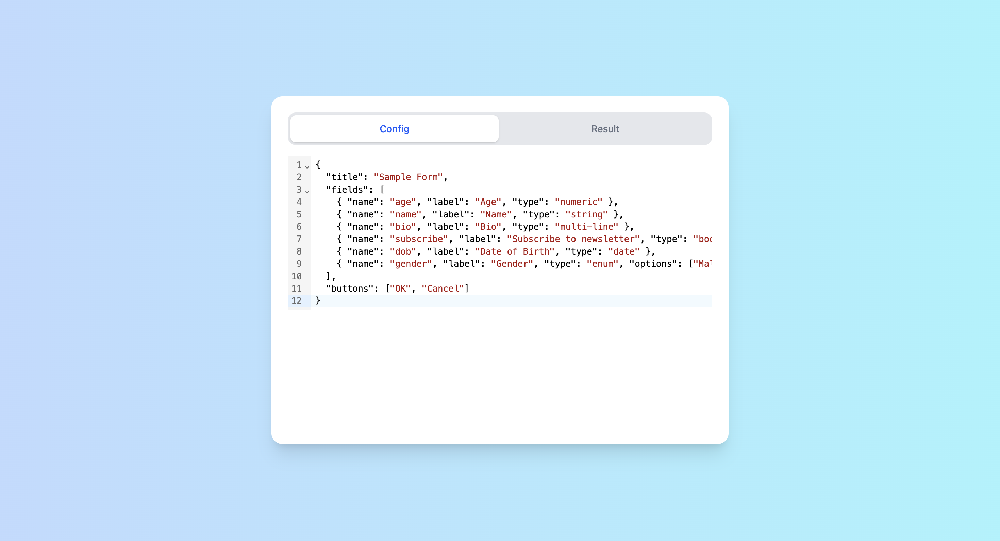
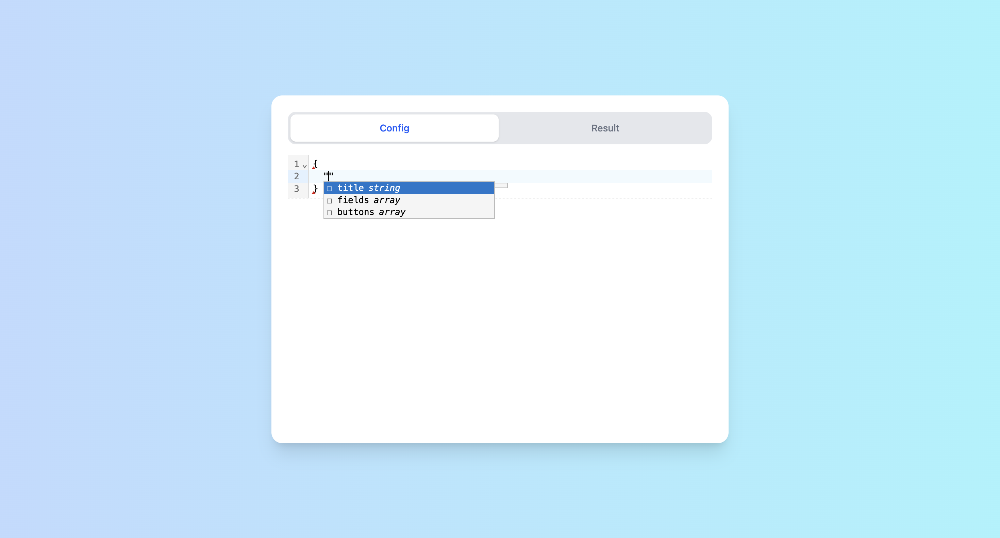
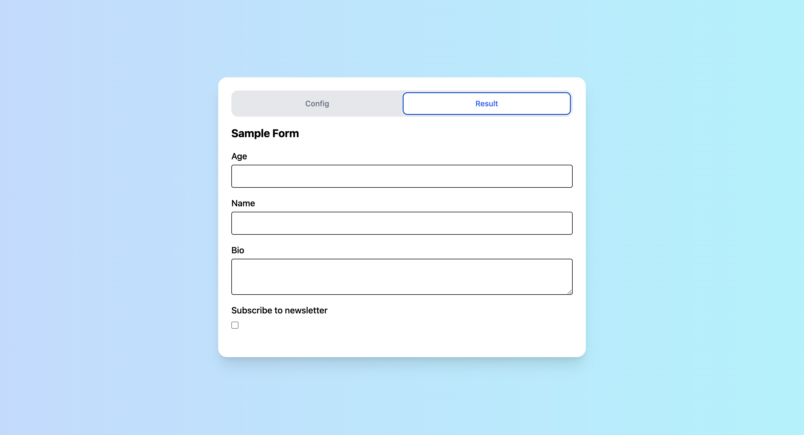

# React JSON-Driven Form Generator

A lightweight React (TypeScript) application that dynamically generates forms based on a JSON configuration. This project was developed as part of the interview process for Veeam. You can find the assignment itself at `/docs` folder.

> **Note**: In this demo project, I focused on functionality over styling. The generated form is static (i.e., it does not include submission logic), but all field renderers are implemented in FieldRenderer.tsx to allow easy future integration.

## Project Structure

```bash
docs/
├── Technical_Task_React.pdf        # Assignment
client/
├── public/                         
├── src/
│   ├── assets/                     
│   ├── components/
│   │   ├── Card/                   # Page card wrapper
│   │   ├── Form/
│   │   │   ├── FieldRenderer.tsx   # Renders each field type
│   │   │   ├── FormGenerator.tsx   # Takes JSON and renders full form
│   │   │   ├── useFormConfig.ts    # Hook to parse & validate JSON
│   │   │   └── types.ts            # Type definitions for config
│   │   ├── JsonEditor/
│   │   │   └── JsonEditor.tsx      # CodeMirror
│   │   └── Tabs/
│   │       ├── Tabs.tsx            # Tab container
│   │       ├── TabList.tsx         # Tab headers
│   │       └── TabsPanels.tsx      # Tab content panels
│   ├── utils/
│   ├── App.tsx
│   ├── index.css
│   ├── main.tsx
│   └── vite-env.d.ts
├── .eslintrc.js
├── index.html
├── package.json
├── tsconfig.app.json
├── tsconfig.json
└── vite.config.ts
```

## Prerequisites

Project requires the following to run:

  * [Node.js][node] v23+
  * [NPM][npm] v10+


[node]: https://nodejs.org/
[npm]: https://www.npmjs.com/

## Installation

Clone the repo:
```bash
TODO
```

Install all the dependencies:
```bash
npm i
```

#### Running Locally (Development)

- In order to run application in production mode, run:

```bash
npm install
# or
yarn install
```
- Open your browser at http://localhost:3000

#### Building & Previewing (Production)

In order to run application in production mode:
```bash
npm run build && npm run preview
```

## Code Style

Lint your code against the ESLint rules:

```bash
npm run lint
```

Code format:
```bash
npm run format
```

## Demo



In the config tab, users can input a form configuration using JSON. 



The editor supports: **syntax highlighting**, **schema-based validation**, **autocomplete suggestions** based on the expected schema.



The result tab renders the form defined in the JSON configuration. Each field is displayed with its corresponding input type.